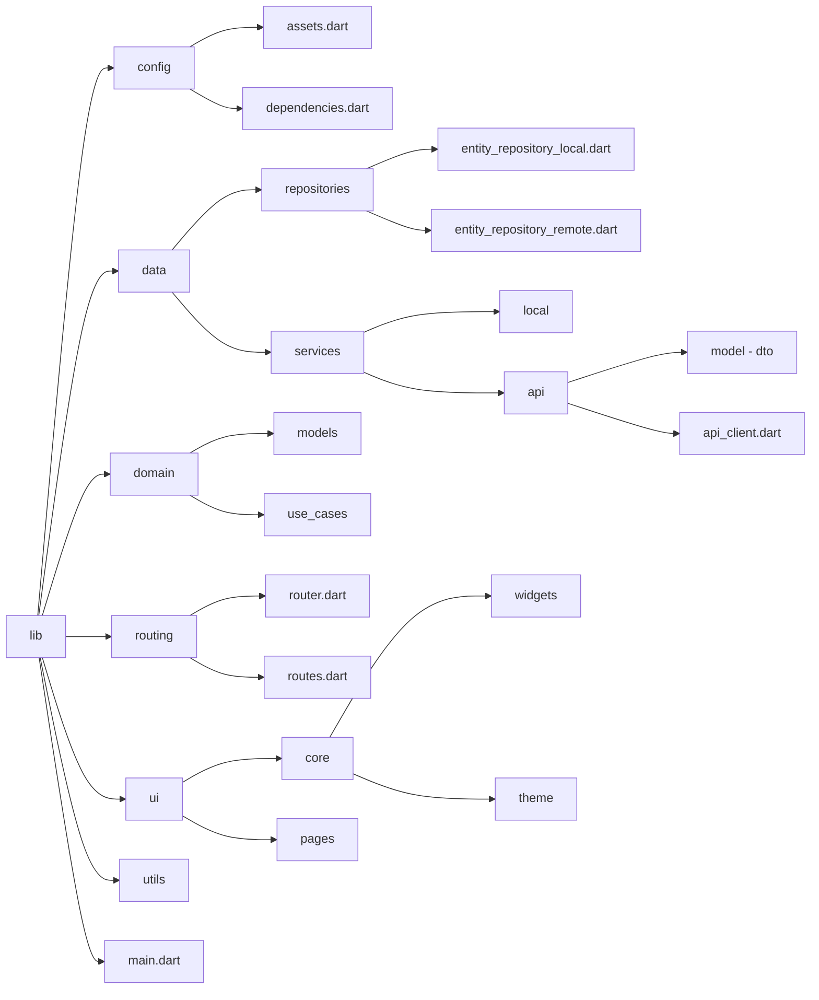

# gymtrack


### 📦 Tecnologias utilizadas


### 📂 Estrutura de Pastas
O projeto segue uma organização modular, separando responsabilidades em diferentes camadas para facilitar a manutenção e escalabilidade. A seguir cada diretório e seus arquivos principais:


### 🛠️ Como Instalar e Rodar
Para configurar e executar o projeto Flutter corretamente no seu ambiente, siga os passos abaixo:
#### 1.Pré-requisitos
Antes de iniciar, certifique-se de ter instalado:
- Flutter SDK (Baixar aqui)
- Dart SDK (já incluído no Flutter)
- Android Studio ou VS Code (para desenvolvimento)
- Dispositivo físico ou emulador configurado
- Git (para clonar o repositório, opcional)
```sh
flutter doctor
```
#### 2.Instalar Dependências
Antes de rodar o aplicativo, instale todas as dependências do Flutter:
```sh
flutter pub get
```
#### 3.Rodar o Aplicativo
Com tudo configurado, execute o comando abaixo para iniciar o app:
```sh
flutter run
```
